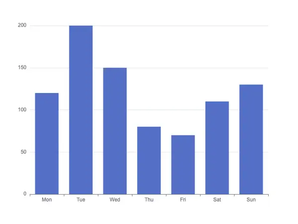

# [H5Charts](https://github.com/oi-contrib/H5Charts)
一个基于 JavaScript 的开源可视化图表库

<p>
    <a href="https://zxl20070701.github.io/toolbox/#/npm-download?packages=h5charts&interval=7">
        
    </a>
    <a href="https://www.npmjs.com/package/h5charts">
        
    </a>
    <a href="https://github.com/oi-contrib/H5Charts" target='_blank'>
        
    </a>
</p>


## 如何使用？

首先需要进行安装：

```
npm install --save h5charts
```

安装完成以后，就可以在项目中引入了：

```js
import H5Charts from "h5charts"
```

下面以绘制一个柱状图为例子：



首先准备好画布：

```html
<div id="root" style="width:500px;height:400px;"></div>
```

然后直接绘制：

```js
var el = document.getElementById("root");
var mychart =  new H5Charts(el, {
    xAxis: {
        data: ["Mon", "Tue", "Wed", "Thu", "Fri", "Sat", "Sun"]
    },
    series: [{
        data: [120, 200, 150, 80, 70, 110, 130],
        type: "bar"
    }]
});
```

如果后续需要修改数据，直接：

```js
mychart.setOption({
    series: [{
        data: [20, 130, 50, 80, 170, 10, 130],
        type: "bar"
    }]
});
```

更多内容和细节，你可以直接[ 查看文档 ](https://oi-contrib.github.io/H5Charts) 获得哦～

> 此外，你还可以使用跨端的[ "H5Charts / Chart" ](./src/chart/README.md)和[ "H5Charts / Canvas" ](./src/canvas/README.md)来创建自己的图表库项目～

## 版权

MIT License

Copyright (c) [zxl20070701](https://zxl20070701.github.io/notebook/home.html) 走一步，再走一步